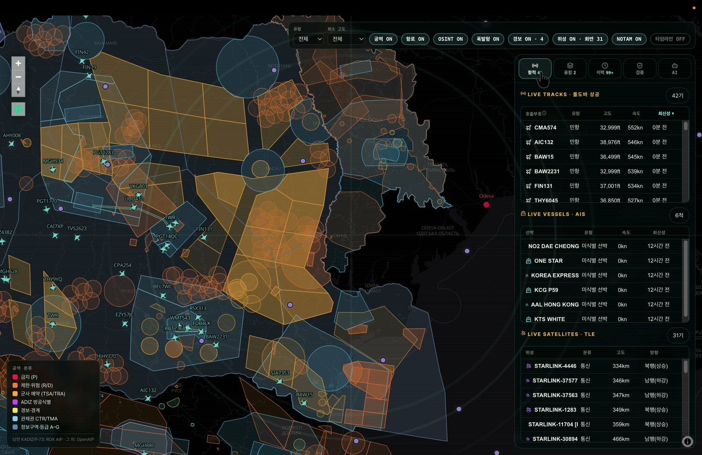
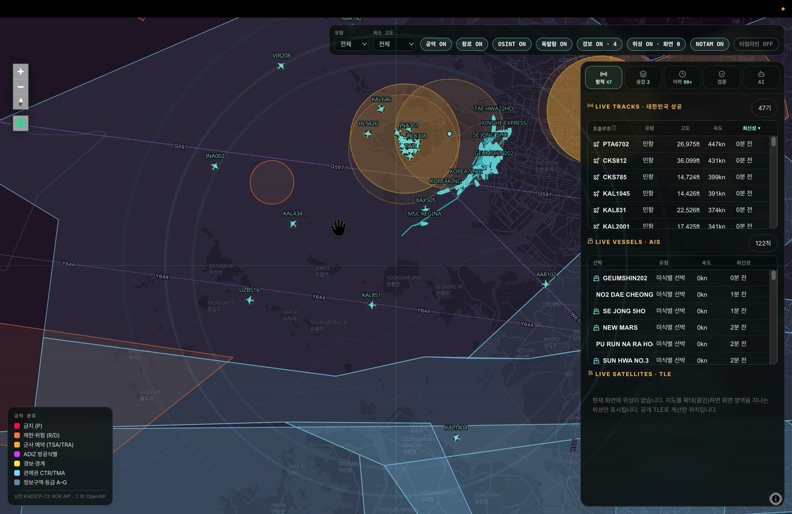
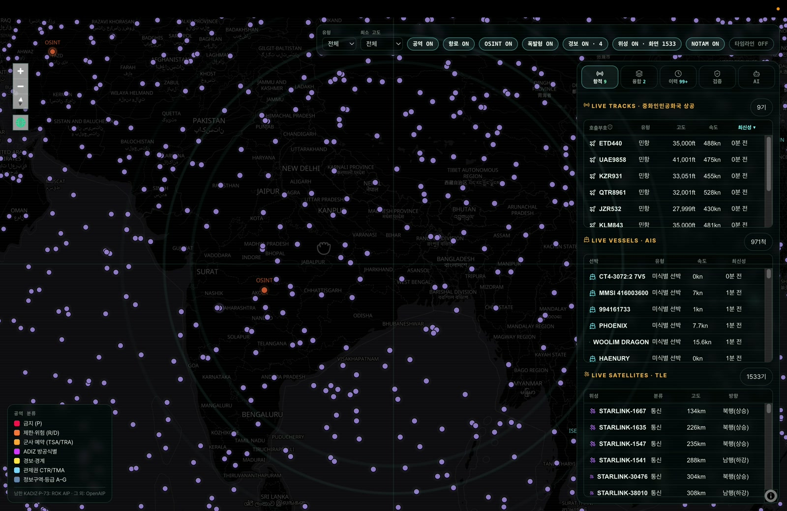
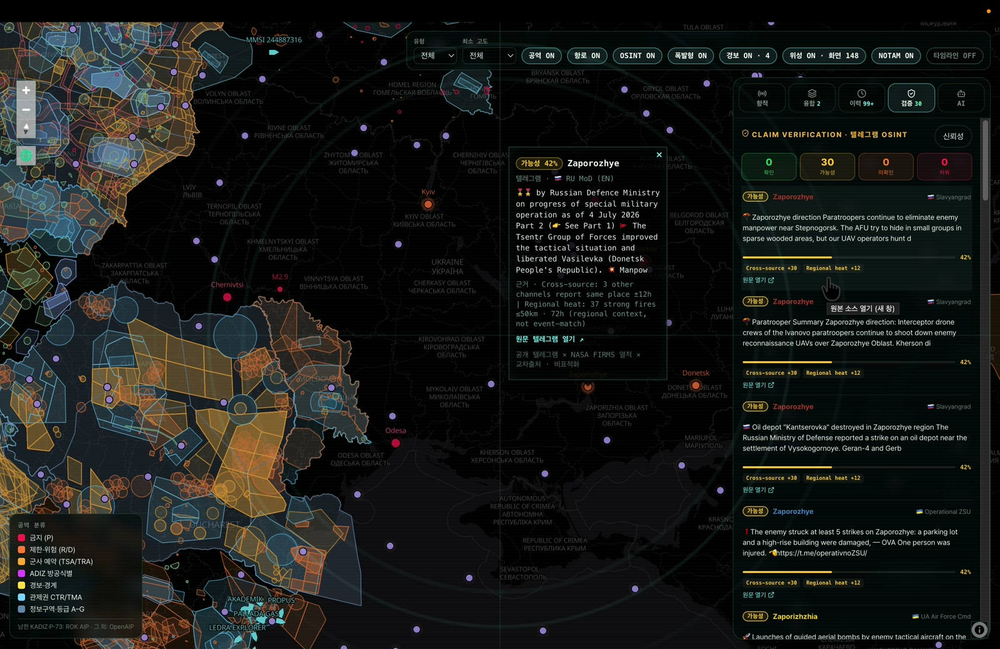
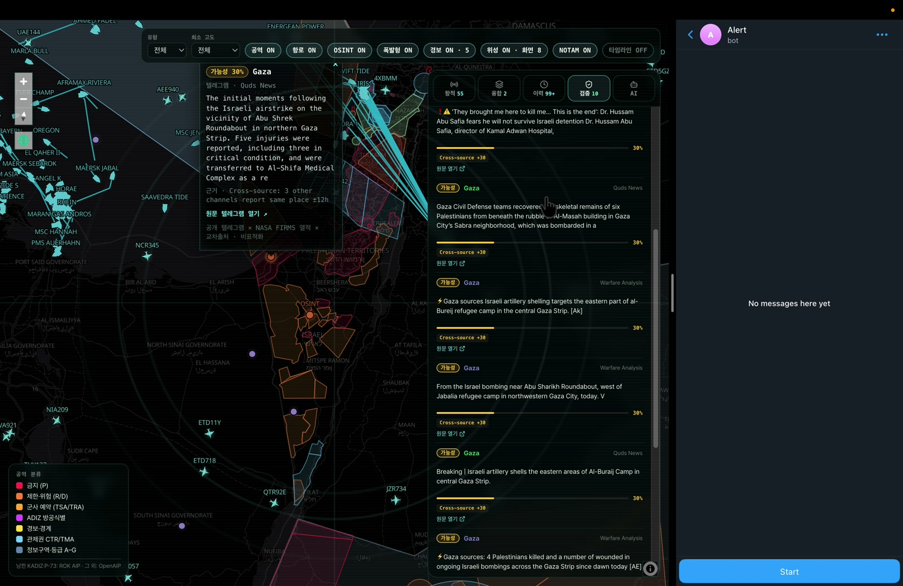
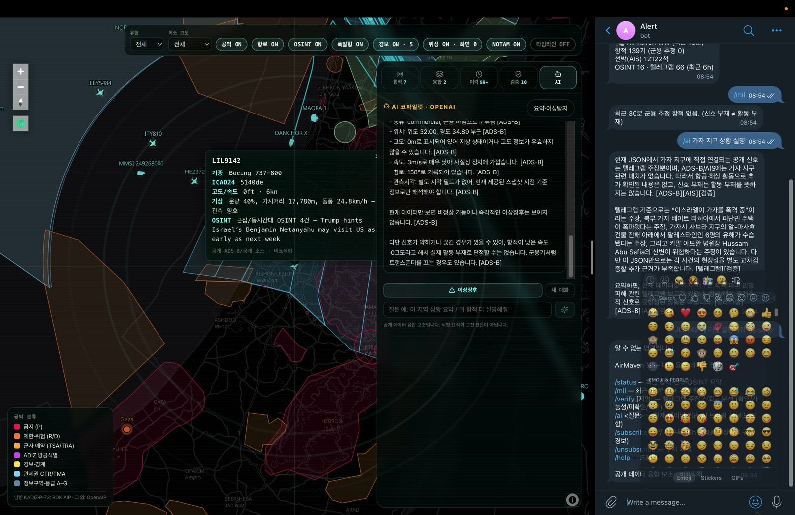

# [오일이] Open Intelligence Layer (OIL)

**공개정보(OSINT)를 실시간으로 융합하고 — 검증하는 — 방어적 상황인식 플랫폼.**

> **Project Maven은 기밀 영상으로 표적을 찾는다. OIL은 공개정보를 교차검증해 진실을 가린다.**
> *Open · Verifiable · Non-targeting · 폰 안의 상황실*
>
> 🌐 라이브 데모: **https://d4d.n2f.site** · 👥 팀 **오일이** · *(개발명 AirMaven)*

---

## 무엇인가

전 세계 **항공(ADS-B) · 해상(AIS) · 위성(TLE) · OSINT(텔레그램)** 데이터를 하나의 실시간 3D 지구본에 융합하고, 텔레그램의 "타격 주장"에 **신뢰도(verdict + 신뢰도% + 근거)를 판정**하며, 웹 대시보드와 **텔레그램 봇**으로 조회·조기경보(I&W)까지 제공한다.

핵심은 **모으기(aggregation)를 넘어 판정(adjudication)** — 주장이 사실인지 **NASA 산불 열데이터 × 교차출처**로 대조해 확인 / 가능성 / 미확인 / 허위로 가른다.

## 📸 스크린샷


<sub>다도메인 융합 상황 글로브 — 공역·항로·실시간 항적·위성을 한 화면에.</sub>

<table>
<tr>
<td width="50%"><br><sub><b>공역 + NOTAM</b> — 분류별 공역 폴리곤과 NOTAM 통제 구역.</sub></td>
<td width="50%"><br><sub><b>실시간 위성</b> — Celestrak TLE를 브라우저에서 SGP4 전파.</sub></td>
</tr>
<tr>
<td width="50%"><br><sub><b>OSINT 신뢰도 판정</b> — verdict + 신뢰도% + 근거(검증 패널).</sub></td>
<td width="50%"><br><sub><b>OSINT 노드 팝업</b> — 주장별 판정·근거·원문 텔레그램 링크.</sub></td>
</tr>
<tr>
<td width="50%"><br><sub><b>텔레그램 봇</b> — 모바일 조회 + 브리핑·이상항적·공습경보 푸시.</sub></td>
<td width="50%"><sub>데모 영상 캡처 · 라이브 데이터는 시점마다 달라집니다.</sub></td>
</tr>
</table>

## 핵심 기능

- **다도메인 융합 글로브** — 항공기 · 선박 · 위성(브라우저 내 SGP4 실시간 궤도)을 한 화면에, 뷰포트/줌 필터.
- **OSINT 신뢰도 판정** — 84개 텔레그램 채널 → 전쟁-결과 필터 → 지오로케이트 → verdict + 0–100% + 근거 원장. FIRMS 실시간 열적 × 교차출처 교차검증(웹·봇 동일 로직).
- **조기경보 레이어** — 우크라이나 공습경보(air_alert_ua) · EMSC 얕은 진원(폭발형) 지진 · ROK 공역(KADIZ·P-73)·항공로 · OpenAIP 공역 · FAA NOTAM.
- **AI 코파일럿** — OpenAI **GPT-5.4-mini** 한국어 지역 요약 · 이상탐지 · 멀티턴. 제공 데이터에만 근거·출처 표기.
- **텔레그램 봇** — 모바일 조회(`/status`·`/mil`·`/verify`·`/ai`) + 능동 푸시(6h 분쟁 브리핑 · 이상 항적[비상 스쿼크·고가치 자산] · 공습경보).
- **타임라인 리플레이** — 최근 6시간 항적·선박·위성 이동 재생.

## 왜 군에 바로 쓰나 (배치 가능성)

- **100% 공개정보 → UNCLASS 즉시 운용.** 기밀을 못 나누는 **연합·동맹 정보공유**에 강하다.
- **표적화가 아닌 결정지원·조기경보(I&W)** → 법적·ROE 문턱이 낮아 야전 도입이 빠르다.
- **이식형** — 서버리스 + 컨테이너 수집기라 온프레미스·에어갭·정부클라우드로 재배치 가능. 봇 전송계층만 승인 메신저로 교체.

## 아키텍처 (요약)

```
공개 소스 ─▶ Vercel Functions(/api, 12개) ─┬─ read: history·telegram·osint·seismic·satellites·firms·openaip
   +                                        └─ bot: /api/tg (웹훅 + 능동 푸시)
Railway 상주 수집기(AIS WebSocket + adsb 폴링) ─▶ Neon Postgres(시계열) ◀─ GitHub Actions cron(15분/6h/5분)
                                                        │
브라우저 SPA(React + MapLibre 3D + SGP4) ◀── /api ─────┘        Telegram Bot ◀── sendMessage
```

상세 → [`docs/ARCHITECTURE.md`](./docs/ARCHITECTURE.md)

## 기술 스택

| 영역 | 기술 |
|---|---|
| 프론트엔드 | Vite · React 18 · TypeScript · MapLibre GL(3D) · satellite.js(SGP4) |
| 서버리스 API | Vercel Functions (Node) — 12 엔드포인트 |
| DB | Neon Postgres (HTTP 드라이버, 시계열) |
| 상주 수집기 | Railway 워커 — AISStream WebSocket + adsb.lol 폴링 |
| 스케줄링 | GitHub Actions cron |
| AI · 봇 | OpenAI(gpt-5.4-mini) · Telegram Bot(웹훅 + 푸시) |

## 데이터 소스

공개 **19종** — adsb.lol · AISStream · Celestrak · NASA FIRMS · EMSC · OpenAIP · data.go.kr(ROK 항공로) · 공개 텔레그램 · Tzeva Adom(이스라엘 공식 사이렌 미러) 등. 키가 필요한 소스는 모두 서버 측 환경변수 전용.
전체 목록 → [`docs/DATA-SOURCES.md`](./docs/DATA-SOURCES.md)

## AI & 텔레그램 봇

웹 AI 코파일럿과 텔레그램 봇은 **동일 공용 모듈**(`db/nameLookup.mjs` 이름조회 · `db/claimAssess.mjs` 신뢰도 채점 · 동일 GPT-5.4-mini)을 써서 내부 데이터 이해·조회가 동등하다. GPT-5 추론 모델용 요청 파라미터도 모델명으로 자동 적응한다.
상세 → [`docs/AI-AND-BOT.md`](./docs/AI-AND-BOT.md)

## 로컬 개발

```bash
npm install
npm run dev          # Vite 앱 + 공개데이터 갱신 루프
# npm run dev:vite   # Vite만
```

```bash
npm run build        # tsc -b && vite build
npm run typecheck    # tsc --noEmit
npm test             # vitest run (61 tests)
npm run lint         # eslint
npm run db:migrate   # Neon 스키마 마이그레이션 (.env 필요)
```

## 배포

- **웹 + API**: Vercel — `npx vercel --prod` (`dist/` 정적 + `api/` 서버리스 함수).
- **상주 수집기**: Railway — 루트 `Dockerfile`이 `collector/`(AIS WebSocket + adsb 폴링) 실행.
- **스케줄러**: GitHub Actions — `record-observations`(15분) · `bot-briefing`(6h) · `bot-rapid`(5분).
- **환경변수**: `.env.example` 참고. 모든 키는 서버 측 전용(브라우저·git 미노출). 요약표 → [`docs/DATA-SOURCES.md`](./docs/DATA-SOURCES.md).

## 문서

| 문서 | 내용 |
|---|---|
| [`docs/PROJECT.md`](./docs/PROJECT.md) | 제출 개요 · anti-Maven 포지셔닝 · 평가기준 매핑 |
| [`docs/ARCHITECTURE.md`](./docs/ARCHITECTURE.md) | 아키텍처 · 서비스 구조 · 기능 목록 |
| [`docs/DATA-SOURCES.md`](./docs/DATA-SOURCES.md) | 외부 데이터·API 19종 · 환경변수 |
| [`docs/AI-AND-BOT.md`](./docs/AI-AND-BOT.md) | AI 코파일럿 & 텔레그램 봇 구조 |

## 안전 원칙 (Non-targeting)

- **결정지원·상황인식 보조**이며 식별·표적화·교전 판단이 아니다. 군용 마커는 공개 ADS-B 플래그 노출일 뿐 신원 식별이 아니다.
- **합성/조작 데이터 없음** — 공개 데이터만, 라이브 검증된 실데이터만.
- **정직한 신뢰도** — 근거가 약하면 점수를 억지로 올리지 않는다.
- 시크릿은 서버 측 전용, 브라우저·git 미노출.

## 한계

- 공개 ADS-B/AIS는 불완전(민감 항공기·수신기 커버리지). 위성은 TLE **계산** 위치(실측 아님).
- 이스라엘 경보는 oref.org.il 해외 IP 차단으로 **Tzeva Adom 미러**(동일 공식 데이터) 사용.
- 크론 기반이라 "즉시"는 ~5–15분 근사(실배치 시 상주 워커로 상향 가능). 텔레그램은 승인 보안망 아님 → 전송계층 교체 전제.

---

**팀 오일이** · D4D Hackathon
