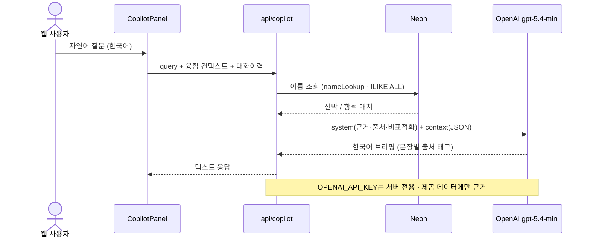
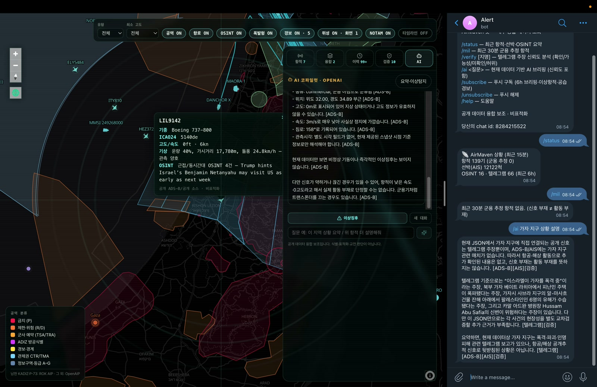
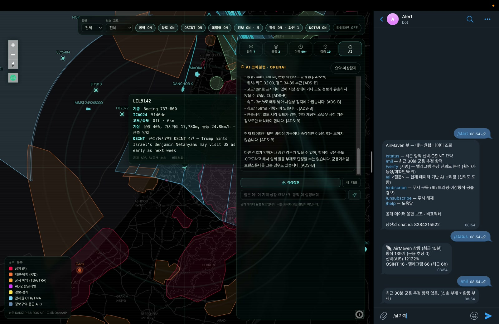
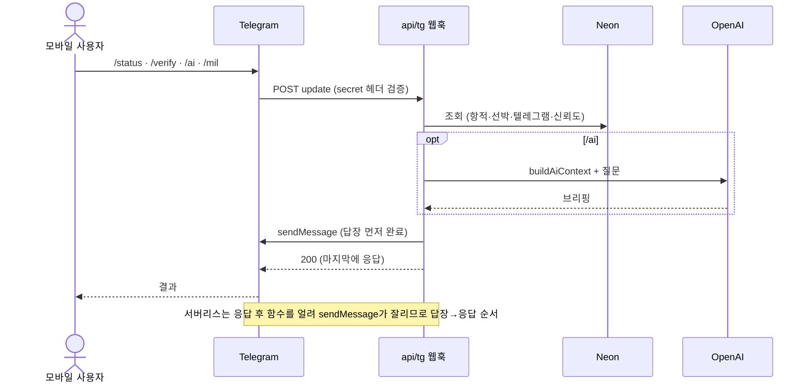
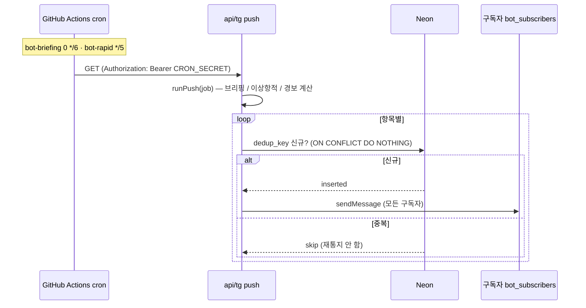

# AI 코파일럿 & 텔레그램 봇 구조

AirMaven의 대화형/능동형 인터페이스 두 축 — 웹 **AI 코파일럿**과 **텔레그램 봇** — 의 구조. 둘 다 **제공된 공개 데이터에만 근거**하며, 식별·표적화가 아닌 상황인식 보조다.

---

## 1. AI 코파일럿 (웹)

지역 상황을 자연어로 묻고, 규칙기반 이상탐지 결과를 AI가 서술하는 사이드 패널.

**구성 파일**
- `api/copilot.mjs` — 서버 함수(키 은닉). 모드 `summary`(질문형 요약) / `anomaly`(이상징후 서술). **질문 속 선박/항공기 명칭은 서버에서 DB 조회**(공용 `db/nameLookup.mjs`)해 컨텍스트에 병합.
- `src/lib/copilotApi.ts` — 클라이언트 `askCopilot(query, context, history, mode)`.
- `src/components/CopilotPanel.tsx` — 멀티턴 대화 스레드 UI.
- `src/lib/trackFusion.ts` — 클라이언트에서 이미 융합된 지역 상황 JSON 컨텍스트 생성(항적·선박·OSINT·신뢰도 claims[verdict/confidence/**evidence**]·규칙기반 이상탐지·NOTAM).

**데이터 흐름**

**프롬프트 설계 (핵심 규칙)**
- 제공된 JSON 데이터에만 근거, 항공기/선박/사건/수치 날조 금지.
- 각 주장 끝 출처 표기 `[ADS-B][AIS][OSINT][텔레그램][NOTAM][FIRMS][공역]`.
- 데이터 희소 시 명시(신호 부재 ≠ 활동 부재; 군용기는 트랜스폰더 off 가능).
- 식별·표적화·교전 판단이 아닌 공개정보 융합 보조.
- 멀티턴: 최근 대화 8턴을 바운드해 연속성 유지(토큰 관리).

**모델 (GPT-5)**
- 기본 `gpt-5.4-mini`(`COPILOT_MODEL` 환경변수, 미설정 시 `gpt-4o-mini`). 웹 Copilot·봇 `/ai`·6h 브리핑 공통.
- GPT-5/o-계열은 **추론 모델**이라 `max_tokens`+`temperature`를 거부(400) → `chatParams(model, maxOut)`가 모델명으로 분기해 `max_completion_tokens`+`reasoning_effort:'low'`를 사용. gpt-4o-mini 기본값도 동일 코드로 동작.

**웹 Copilot ↔ 텔레그램 봇 동등성**
- 두 인터페이스는 **동일한 공용 모듈**을 쓴다: `db/nameLookup.mjs`(이름 조회, `ILIKE ALL`) · `db/claimAssess.mjs`(신뢰도 채점) · 동일 GPT-5.4-mini.
- 결과: 특정 선박/항공기 이름 조회, 신뢰도(verdict/confidence/evidence) 설명, AI 응답 품질이 웹·봇에서 동일하게 동작.

---

## 2. 텔레그램 봇

모바일에서 내부 융합 데이터를 **조회**하고, 위협을 **능동 푸시**받는 인터페이스. 단일 서버 함수 `api/tg.mjs`에 웹훅 + 푸시가 통합돼 있다(Vercel Hobby 12-함수 한도 대응).

<table>
<tr>
<td width="50%"> <b>봇 대화</b> — 명령 응답(출처·판정 포함)을 폰에서 바로.</td>
<td width="50%"> <b>봇 + 글로브</b> — 같은 데이터를 웹과 봇이 동일하게 응답.</td>
</tr>
</table>

### 2.1 조회 (요청-응답 웹훅)

| 명령 | 동작 |
|---|---|
| `/start` `/help` | 도움말 + 본인 chat id 회신 |
| `/status` | 최근 15분 항적·군용·선박 + 6h OSINT·텔레그램 카운트 |
| `/mil` | 최근 30분 군용 추정 항적 목록 |
| `/verify [지명]` | 텔레그램 주장 신뢰도 분석(확인/가능성/미확인/허위 + %·근거) |
| `/ai <질문>` | 현재 DB 데이터 기반 AI 브리핑(신뢰도 포함, 선박/항공기 이름 조회) |
| `/subscribe` `/unsubscribe` | 능동 푸시 구독/해제 |

**`/ai` 컨텍스트 빌드(`buildAiContext`)** — 최근 항적 샘플 + 선박 수 + **이름 기반 조회**(공용 `db/nameLookup.mjs`, `ILIKE ALL` 정밀 매칭 — 웹 Copilot과 공유) + **신뢰도 채점 claims** + 텔레그램 원문. → OpenAI에 전달.

**접근 제어** — `TELEGRAM_WEBHOOK_SECRET`(위조 차단) + `TELEGRAM_OPEN=1`(데모 오픈) 또는 `TELEGRAM_ALLOWED_CHAT_IDS`(화이트리스트). `/start`·`/help`는 항상 허용.

### 2.2 능동 푸시 (크론 트리거)

| Job | 내용 | 소스 | 중복방지 키 |
|---|---|---|---|
| `briefing` | ① 6시간 UA·중동 한국어 브리핑 + 타격 헤드라인 | `buildAiContext` + OpenAI | `briefing:{6h버킷}` |
| `anomaly` | ② 비상 스쿼크(7700/7600/7500) + 고가치 자산(AWACS/ISR/급유기/폭격기) | `db/anomalyAircraft.mjs`(adsb.lol) | `emg:{hex}:{sq}:{3h}` / `hva:{hex}:{6h}` |
| `alert` | ③ 공습·격추 경보(공식 사이렌 100%) + 신뢰도 높은 텔레그램 타격보도 | `db/airAlert.mjs`(UA) · `db/israelAlert.mjs`(IL) · `gatherClaims` | `ua-alert`/`il-alert`/`claim:{key}` |

- **중복방지**: `bot_push_log(dedup_key PK)` — `INSERT … ON CONFLICT DO NOTHING RETURNING`. 반환이 있으면 신규 → 발송. 5분 폴이 같은 사건을 재통지하지 않음. 3일 후 prune.
- **고가치 자산 분류**: 앵커드 ICAO 타입코드(`^…$`)로 H60(블랙호크) 같은 근접 오탐 차단. `/mil` 결과 내에서만 매칭.

### 2.3 봇이 재사용하는 공용 모듈

| 모듈 | 역할 |
|---|---|
| `db/claimAssess.mjs` | 신뢰도 채점(웹 검증 패널 `claimVerify.ts`와 **동일 로직** 서버 이식) |
| `db/nameLookup.mjs` | 이름 기반 선박/항공기 조회(`ILIKE ALL`) — **봇·웹 Copilot 공용** |
| `db/firms.mjs` | 주장 지역 NASA FIRMS 실시간 열점(교차검증) |
| `db/airAlert.mjs` | 우크라이나 공습경보(오블라스트 상태 재생) |
| `db/israelAlert.mjs` | 이스라엘 경보(Tzeva Adom = Pikud HaOref 공식 미러) |
| `db/anomalyAircraft.mjs` | 비상 스쿼크 + 고가치 자산 |
| `db/client.mjs` | Neon SQL |

---

## 3. 보안 · 정직성

- **키 은닉**: `OPENAI_API_KEY`·`TELEGRAM_BOT_TOKEN`·`CRON_SECRET`은 서버 환경변수 전용, 레포·클라이언트 미노출.
- **인증 3중**: 웹훅=`TELEGRAM_WEBHOOK_SECRET` 헤더 / 푸시=`CRON_SECRET` Bearer / 데이터 명령=오픈 또는 chat_id 화이트리스트.
- **비표적화·근거주의**: AI는 제공 데이터에만 근거·출처 표기, 신뢰도는 근거 약하면 낮게 유지(인플레 없음).
- **전송계층 독립**: 봇 로직은 sendMessage 어댑터에만 의존 → 실배치 시 승인된 국방 메신저로 교체 가능.

## 4. 관련 문서
- [ARCHITECTURE.md](./ARCHITECTURE.md) · [DATA-SOURCES.md](./DATA-SOURCES.md) · [PROJECT.md](./PROJECT.md)
